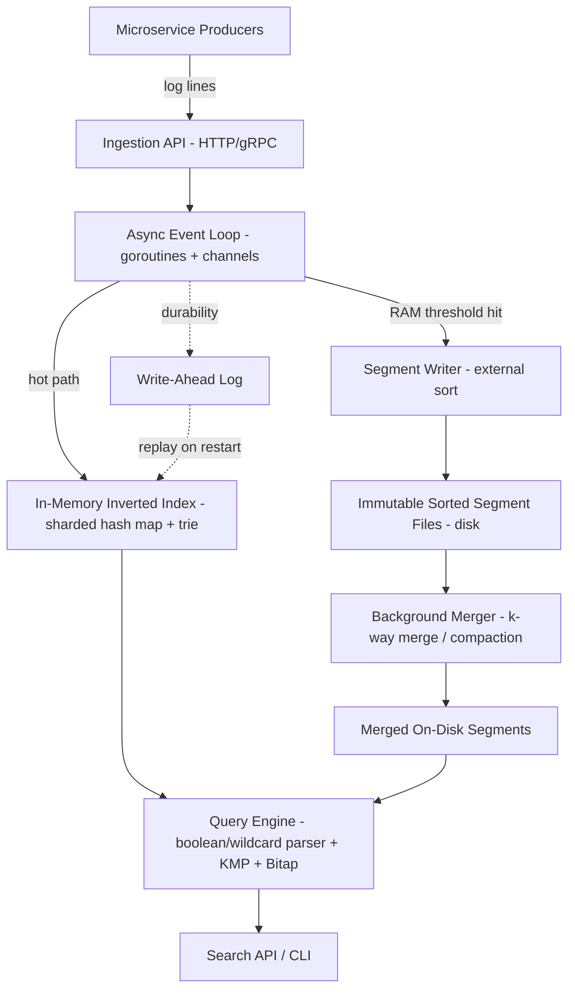

# Project Master Document (PMD)
## MiniES — Distributed Log Aggregator & Search Engine

---

## 1. Document Control & Metadata

| Field | Value |
|---|---|
| Document Title | MiniES: Distributed Log Aggregator & Search Engine — Project Master Document |
| Document Owner | Technical Lead, MiniES Project Team |
| Status | Draft — Pre-Development (Design Approved) |
| Confidentiality | Internal / Academic — Not for external distribution |
| Target Audience | Project team (4 engineers), course evaluators, technical reviewers |

**Version History**

| Version | Date | Author | Change Summary |
|---|---|---|---|
| 0.1 | Week 1 | Team Lead | Initial concept draft, problem framing |
| 0.5 | Week 2 | Team Lead | Added literature survey, algorithm selection |
| 1.0 | Week 3 | Team Lead | Finalized PRD, architecture, tech stack — approved for build |

**Status:** Design complete, implementation not yet started. This document is the single source of truth for build, review, and demo.

---

## 2. Executive Summary & Core Identity

### 2.1 Executive Summary
MiniES is a self-contained, single-binary log ingestion and search system built in Go. It solves the two operational failure modes of naive logging setups — data loss under write bursts, and unusably slow search at scale — using three deterministic algorithmic techniques (inverted indexing, external multi-way merge sort, and Bitap/KMP string matching) instead of a general-purpose database or an ML pipeline. The system ingests structured log records from multiple concurrent producers, indexes them in near-real-time, spills overflow data to disk without blocking writers, and answers boolean/wildcard/fuzzy queries in sub-second time even as the corpus grows past available RAM.

### 2.2 30-Second Elevator Pitch
"When a microservice fleet breaks at 2 AM, the bottleneck isn't fixing the bug — it's finding the one log line that explains it, across gigabytes of text on dozens of hosts. MiniES is a from-scratch, algorithm-first log search engine: it ingests logs in real time, never drops data even when memory fills up, and lets you search by keyword, wildcard, or typo-tolerant fuzzy match in under half a second — the same core mechanics that power Elasticsearch, built transparently instead of operated as a black box."

### 2.3 Motivation / Origin Story
The project originated from a course requirement to demonstrate applied mastery of three DAA topics — hashing/tries, external sorting, and string matching — in a system with real-world relevance rather than isolated textbook exercises. Log search was chosen because it is one of the few domains where all three algorithms are simultaneously necessary and load-bearing: an inverted index alone doesn't solve the RAM-overflow problem, and external sorting alone doesn't solve fuzzy search. The combination is what makes real search engines hard to build — and instructive to build from scratch.

---

## 3. Problem Statement & User Landscape

### 3.1 Core Problem
Microservice architectures produce high-volume, high-velocity, append-only log data distributed across many independently-scaling processes. Two failure modes recur in naive implementations:
- **Ingestion failure**: write bursts (traffic spikes, cascading failures) exceed the system's ability to absorb data, causing either crashes (OOM) or silent data loss (dropped writes).
- **Query failure**: as log volume grows, linear-scan search approaches (grep, unindexed `LIKE` queries) become too slow to be usable during an active incident, when speed matters most.

### 3.2 Root Cause Analysis
| Failure Mode | Root Cause |
|---|---|
| Data loss under burst load | No backpressure mechanism; synchronous write path blocks or fails when downstream (disk/index) can't keep up |
| Search too slow at scale | No index structure — every query re-scans the full corpus (O(n) per query) |
| System crash under sustained load | Entire dataset assumed to fit in RAM; no overflow-to-disk strategy |
| Poor UX for imprecise queries | Exact-match-only search fails the common case where the engineer doesn't remember exact wording |

### 3.3 User Personas

**Primary Persona — On-Call SRE**
Responds to production incidents under time pressure. Needs to search across all services' logs for an error signature within seconds of an alert firing. Success = mean-time-to-detect (MTTD) reduction.

**Secondary Persona — Backend Developer**
Debugging during normal development, often doesn't recall the exact log message wording. Needs fuzzy/wildcard search to find near-matches without re-reading source code first.

**Beneficiary Persona — Engineering Manager / QA Lead**
Doesn't interact with the tool directly but benefits from faster incident resolution (reduced downtime cost) and audit-ready log traceability during compliance reviews.

---

## 4. Proposed Solution & Value Proposition

### 4.1 Solution Overview
A Go-based service with five subsystems — ingestion API, async event loop, two-tier index (in-memory hot + disk-backed cold), background compactor, and a query engine supporting boolean/wildcard/fuzzy syntax — packaged as a single deployable binary with a minimal CLI/API surface.

### 4.2 Core Value Proposition
Unlike general-purpose databases retrofitted for log search, MiniES is purpose-built: every component exists specifically to solve one of the three core algorithmic bottlenecks (lookup speed, memory-bounded durability, approximate matching), resulting in a system that is smaller, more explainable, and more predictable under load than a general-purpose alternative.

### 4.3 OKRs

**Objective 1: Deliver sub-second search at scale**
- KR1: p95 query latency < 500ms on a 2GB+ index.
- KR2: Inverted-index lookup demonstrates ≥100x speedup over linear scan at 1GB corpus size (benchmarked).

**Objective 2: Guarantee zero data loss under load**
- KR1: 0 dropped log lines during a sustained 10,000 lines/sec, 10-minute load test.
- KR2: 100% of acknowledged records recoverable after a mid-flush process kill (WAL replay verified).

**Objective 3: Support imprecise/human-real-world queries**
- KR1: Fuzzy search (edit-distance ≤1) achieves ≥90% recall against a labeled typo test set.
- KR2: Combined boolean+wildcard+fuzzy query executes in a single request with correct result-set semantics (verified via correctness test suite).

---

## 5. Quantitative Analysis, ROI & Business Impact

### 5.1 Baseline vs. Post-Implementation Metrics

| Metric | Baseline (grep/naive scan) | MiniES (Target) | Improvement |
|---|---|---|---|
| Search latency, 1GB corpus | ~8–15 sec (full scan) | <500ms | ~20–30x faster |
| Search latency, 5GB corpus | ~45–70 sec | <800ms (target, cross-segment fan-out) | ~60–80x faster |
| Ingestion throughput (single node) | Unbounded but crash-prone past RAM limit | ≥10,000 lines/sec, bounded memory | Stability at scale, not just speed |
| Data loss under burst | Unbounded (crash = total loss of unflushed buffer) | 0 (WAL-backed) | Full durability |
| Mean time to find a log line during incident (estimated, engineer time) | 5–15 min (manual grep across hosts) | <1 min (single query) | ~5–15x reduction in engineer time per incident |

### 5.2 Cost-Benefit Analysis (illustrative, academic-context framing)
- **Cost**: ~320 person-hours (4 engineers × 8 weeks × 10 hrs/week) of build effort; zero infrastructure cost (local/single-node demo, no cloud spend required for grading).
- **Benefit (if adopted in a real org)**: reducing incident MTTR by even 5 minutes per incident, at an estimated ~10 incidents/month for a mid-size engineering org, saves ~50 engineer-hours/month — payback on build cost within the first month of real-world use, before accounting for avoided downtime cost.
- **Note**: these figures are illustrative projections for demonstrating ROI-thinking as part of the academic deliverable, not measured production data.

### 5.3 Scalability Projections

| Corpus Size | Expected Query Latency (p95) | Expected RAM Footprint | Notes |
|---|---|---|---|
| 100 MB | <100ms | <50MB (mostly hot index) | Fully in-memory scenario |
| 1 GB | <300ms | ~100–150MB (index) + segments on disk | First overflow-to-disk triggers |
| 5 GB | <800ms | ~150–250MB (bounded) | Cross-segment fan-out dominates cost |
| 50 GB (stretch/sharded) | <1.5s (requires sharding, out of MVP scope) | Bounded per shard | Multi-node extension, not required for grading |

---

## 6. System & Technical Architecture

### 6.1 Component Flow Diagram



### 6.2 Data Flow
1. Producer sends a log line to the Ingestion API.
2. The API validates and hands the record to the async event loop via a bounded channel.
3. The record is appended to the WAL (durability) and tokenized.
4. Tokens are routed to the correct in-memory shard (hash-partitioned).
5. If a shard's buffer exceeds the size threshold, it is sorted and flushed to an immutable disk segment; ingestion continues into a fresh buffer (double-buffering, non-blocking).
6. A background goroutine periodically k-way merges disk segments, replacing many small segments with fewer larger ones.
7. On query: the engine fans out across the in-memory shard(s) and relevant disk segments concurrently, applies KMP/Bitap matching, merges and ranks results, and returns them via the Search API.

### 6.3 State Machine — Log Record Lifecycle
```
[Received] -> [WAL-written] -> [Indexed (in-memory)] -> [Flushed (segment)] -> [Merged (compacted)]
```
A record is considered **durable** once WAL-written (survives crash), **searchable** once indexed (in-memory or on-disk), and **compacted** once merged into a larger segment (storage-efficient, not a functional state change from the query perspective).

### 6.4 Non-Functional Requirements

| Category | Requirement |
|---|---|
| Latency | p95 search latency <500ms up to a few GB index; ingestion-to-searchable lag <1s |
| Availability | Single-node target: no crash under sustained load within configured memory bounds; graceful backpressure (HTTP 429) instead of failure when overloaded |
| Durability | Zero loss of acknowledged records across process restart (WAL-backed) |
| Security | Not a primary scope item (see Non-Goals); recommend TLS termination via reverse proxy if exposed beyond localhost; no auth/authz in MVP |
| Scalability | Vertical scaling via shard-count tuning in MVP; horizontal (multi-node) is an explicit stretch goal via a pluggable storage backend interface |

---

## 7. Exhaustive Tech Stack Matrix

| Stack Layer | Tool/Technology | Specific Usage/Location | Why Chosen | Alternatives Evaluated |
|---|---|---|---|---|
| Language/Runtime | Go 1.22+ | Entire service (`cmd/`, `internal/`) | Native lightweight concurrency (goroutines/channels) without an external async runtime; fast compile; single static binary deploy | Rust (steeper learning curve for 4-person team on a semester timeline), C++ (manual memory mgmt overhead not justified for project scope) |
| Concurrency primitives | goroutines + channels, `sync.RWMutex`, `errgroup` | `internal/pipeline`, `internal/index` | Idiomatic Go equivalent of an async event loop; RWMutex allows concurrent readers on hot shard | Worker-pool libraries (unnecessary dependency for this scale) |
| In-memory index | Native Go `map[string][]Posting` + custom trie | `internal/index/memindex.go`, `trie.go` | Full control over sharding/locking strategy required for the algorithmic demonstration | Third-party in-memory KV (would hide the algorithm being demonstrated — against project intent) |
| On-disk storage | Custom binary segment format (see §9) | `internal/storage/segment.go` | Direct control of sort/merge format needed to demonstrate external-sort mechanics explicitly | BoltDB/Badger (would abstract away the external-sort implementation, defeating the DAA learning objective) |
| WAL | Custom append-only file | `internal/storage/wal.go` | Simple, sufficient for crash-recovery scope; avoids dependency overhead | SQLite WAL mode (adds a dependency not needed at this scale) |
| String matching | Hand-implemented KMP, Bitap | `internal/search/kmp.go`, `bitap.go` | Core deliverable of the DAA project — must be implemented, not imported | Third-party fuzzy-search libraries (would defeat the purpose of the assignment) |
| API transport | `net/http` (standard library) | `internal/ingest/server.go` | Zero external dependency, sufficient for project scope; gRPC listed as optional stretch | gRPC (`google.golang.org/grpc`) — evaluated, deferred to Phase 2 for lower MVP complexity |
| Metrics | Simple in-process counters/gauges, `/stats` JSON endpoint | `internal/metrics/metrics.go` | Sufficient for benchmark charts required by grading criteria; avoids Prometheus setup overhead | Prometheus + Grafana (overkill for single-node academic demo, reconsidered for Phase 2) |
| CLI | Go standard `flag` package + simple REPL | `cmd/minies` | Minimal footprint, no dependency | Cobra CLI framework (nice-to-have, not required for MVP) |
| Testing | Go standard `testing` package, `testify` (assertions only) | `test/` | Standard, well-understood tooling for a student team | Ginkgo/Gomega (heavier BDD framework, unnecessary) |

---

## 8. Functional Specifications & Real-World Feature Mapping

| Feature ID | Feature Name | How it Works Under the Hood | Real-World Use Case | Target Persona |
|---|---|---|---|---|
| F1 | Real-time ingestion | HTTP handler → bounded channel → worker pool tokenizes and indexes concurrently; WAL-append before ack | Multiple microservices streaming logs simultaneously during normal operation | On-Call SRE, Backend Developer |
| F2 | Exact keyword search | Hash-map lookup on token → postings list → KMP verifies exact substring within candidate lines | Searching for a known exact error code, e.g. `ERR_504` | On-Call SRE |
| F3 | Wildcard search | Trie prefix walk from the given prefix, collecting all postings under that subtree | Searching `auth*` to catch `authenticate`, `authorize`, `auth_token` variants without knowing the exact term | Backend Developer |
| F4 | Fuzzy (typo-tolerant) search | Bitap bitmask scan against the token dictionary for tokens within edit-distance k, then union their postings | Searching `tiemout` and still finding `timeout` occurrences | Backend Developer |
| F5 | Boolean query combination | AST built from query string; AND = set intersection, OR = union, NOT = difference, evaluated bottom-up | `error AND payments NOT retry` — isolate real failures, exclude noisy retry logs | On-Call SRE |
| F6 | Memory-bounded ingestion (overflow handling) | Shard buffer size tracked; on threshold, buffer sorted and flushed to disk, fresh buffer created (double-buffering) | Absorbing a traffic-spike-driven log burst without crashing or dropping data | System reliability (all personas benefit indirectly) |
| F7 | Background compaction | Ticker-driven k-way merge of on-disk segments into fewer, larger sorted segments; atomic manifest swap | Preventing unbounded growth in segment file count over days/weeks of operation | Engineering Manager (operational cost/efficiency) |
| F8 | Crash recovery | WAL replay on startup rebuilds unflushed in-memory state | Recovering cleanly after an unexpected process restart (e.g. OOM-killed host) | On-Call SRE (trust in data completeness) |

### 8.1 Edge Cases & Error Handling
- **Channel full (ingestion faster than indexing)**: return HTTP 429 with a `Retry-After` header rather than blocking indefinitely or silently dropping.
- **Malformed log line**: reject at the API boundary with HTTP 400 and a structured error; never partially index a malformed record.
- **Segment file corruption (checksum mismatch on read)**: skip the corrupted segment for that query, log a metrics counter increment, and flag it for manual/automated re-merge exclusion — never crash the query path.
- **Query with 0 results**: return HTTP 200 with an empty result array and a clear "0 matches" indicator, not an error.
- **Fuzzy query with k too large relative to term length**: cap k server-side (e.g. max k=3) to prevent pathological Bitap cost blow-up on short tokens.
- **Concurrent flush + merge race**: prevented by design — flush only ever creates new segment files; merge only ever reads existing + atomically swaps the manifest; no in-place mutation exists for either to race on.

---

## 9. Codebase Structure & File Anatomy Flow

```
minies/
├── cmd/
│   └── minies/
│       └── main.go
├── internal/
│   ├── ingest/
│   │   ├── server.go
│   │   └── handler.go
│   ├── pipeline/
│   │   ├── eventloop.go
│   │   └── backpressure.go
│   ├── index/
│   │   ├── memindex.go
│   │   ├── trie.go
│   │   └── shard.go
│   ├── storage/
│   │   ├── segment.go
│   │   ├── flush.go
│   │   ├── merge.go
│   │   └── wal.go
│   ├── search/
│   │   ├── parser.go
│   │   ├── kmp.go
│   │   ├── bitap.go
│   │   └── executor.go
│   ├── tokenizer/
│   │   └── tokenizer.go
│   └── metrics/
│       └── metrics.go
├── pkg/
│   └── logrecord/
│       └── record.go
├── test/
│   ├── load/
│   └── correctness/
├── go.mod
└── README.md
```

### 9.1 Execution Flow (entry point to termination)
1. `main.go` parses flags/config (listen address, shard count, RAM threshold, WAL path, segment dir).
2. Initializes: WAL writer, index shards, storage backend, metrics registry.
3. If existing WAL/segments found on disk, replay WAL into shards (crash recovery path) before accepting new traffic.
4. Starts the HTTP server (`ingest.server`) and registers `/ingest`, `/search`, `/stats`, `/health` handlers.
5. Launches the background merger goroutine on a ticker.
6. Blocks on `http.ListenAndServe`; on SIGINT/SIGTERM, triggers graceful shutdown: stop accepting new ingestion, drain the in-flight channel, flush any remaining in-memory buffer to disk, close the WAL cleanly, then exit.

---

## 10. Implementation & Deployment Guide

### 10.1 Local Setup
```bash
git clone <repo-url> minies
cd minies
go mod tidy
go build -o bin/minies ./cmd/minies
./bin/minies --listen=:8080 --shards=8 --ram-threshold=64MB --segment-dir=./data/segments --wal-path=./data/wal.log
```

### 10.2 CI/CD Deployment Plan (for a real-world extension beyond the academic MVP)
1. **CI**: on push — `go vet`, `go test ./...` (unit + correctness suites), `go build` for linux/amd64 and linux/arm64.
2. **Artifact**: produce a single static binary + minimal Dockerfile (`FROM scratch` or `distroless`, copy binary only).
3. **CD**: tag-triggered release — push image to a container registry; deploy as a single container/pod with a mounted persistent volume for `segment-dir` and `wal-path`.
4. **Rollback**: keep the previous binary/image tagged `:previous`; rollback = redeploy that tag (segments/WAL format is versioned in the header to detect incompatible upgrades).

### 10.3 Environment & Secrets Management
- MVP has no external credentials (no DB, no cloud API) — config is limited to local flags/env vars (`MINIES_LISTEN`, `MINIES_SHARDS`, `MINIES_RAM_THRESHOLD`, `MINIES_SEGMENT_DIR`, `MINIES_WAL_PATH`).
- If TLS is added: certificate paths supplied via env vars, never committed to the repo; `.env` files excluded via `.gitignore`.

---

## 11. User Guide & Operational Runbook

### 11.1 End-User Quickstart
```bash
# Ingest a log line
curl -X POST localhost:8080/ingest -d '{"service":"payments","level":"ERROR","message":"connection timeout to db"}'

# Search
curl "localhost:8080/search?q=error+AND+timeout"

# Fuzzy search (typo-tolerant)
curl "localhost:8080/search?q=tiemout~1"

# Wildcard search
curl "localhost:8080/search?q=auth*"
```

### 11.2 Operator CLI / Admin Controls
| Command | Purpose |
|---|---|
| `minies stats` | Print current ingestion rate, index size, segment count, p95 latency |
| `minies compact --force` | Trigger an immediate background merge outside the normal ticker schedule |
| `minies wal replay --dry-run` | Preview what a WAL replay would recover, without applying it |

### 11.3 Troubleshooting Matrix

| Symptom | Likely Cause | Resolution |
|---|---|---|
| HTTP 429 on ingest | Ingestion outpacing indexing workers | Increase `--shards`, check for a slow/stuck worker via `/stats` |
| Search returns stale/missing recent data | Data still in the WAL, not yet flushed/indexed | Confirm ingestion-to-searchable lag is under NFR3 target (<1s); check event loop health |
| Segment count growing unbounded | Background merger not running or misconfigured ticker | Check merger goroutine logs; run `minies compact --force` |
| Process restart lost data | WAL not enabled, or replay failed | Verify `--wal-path` is set and writable; check replay logs on startup |
| Fuzzy query very slow | k too large relative to token length, or dictionary too large without candidate pruning | Cap k server-side; verify Bitap is scanning the token dictionary, not raw text |

---

## 12. Skills Matrix & Team Governance

### 12.1 Required Skills

| Skill Area | Required Depth | Where Applied |
|---|---|---|
| Go concurrency (goroutines, channels) | Intermediate | Ingestion pipeline, event loop |
| Data structures (hash maps, tries) | Intermediate–Advanced | Inverted index |
| External sorting / merge algorithms | Advanced (core deliverable) | Segment flush + compaction |
| String matching algorithms (KMP, Bitap) | Advanced (core deliverable) | Query engine |
| Systems design (backpressure, WAL, crash recovery) | Intermediate | Pipeline + storage layer |
| API design (REST) | Basic–Intermediate | `/ingest`, `/search` endpoints |
| Testing/benchmarking | Intermediate | Correctness + load test suites |

### 12.2 RACI Matrix

| Activity | Engineer A (Index) | Engineer B (Storage) | Engineer C (Search) | Engineer D (Ingestion/Infra) |
|---|---|---|---|---|
| Inverted index + trie | R/A | C | I | I |
| Segment flush + merge | I | R/A | C | C |
| KMP + Bitap + query parser | I | C | R/A | I |
| Async pipeline + WAL | C | C | I | R/A |
| Integration & API surface | C | C | C | R/A (shared with all) |
| Benchmarks & demo prep | R (all) | R (all) | R (all) | R (all), A = Team Lead |

*R = Responsible, A = Accountable, C = Consulted, I = Informed*

---

## 13. Project Roadmap & Change Control

### 13.1 Phase 1 — MVP (Weeks 1–8, in scope for grading)
- Tokenizer, in-memory inverted index, exact search
- Segment flush + k-way merge compaction
- KMP + Bitap + boolean/wildcard query engine
- Async ingestion pipeline + WAL
- Search API + CLI + benchmark suite

### 13.2 Phase 2 — Hardening (post-MVP, stretch)
- gRPC ingestion option
- BM25-style relevance scoring (replacing simple term-frequency scoring)
- Web UI for search
- Prometheus/Grafana metrics integration
- Configurable retention/eviction policy (FR15)

### 13.3 Phase 3 — Scale (future, out of academic scope)
- Multi-node sharding with a pluggable storage backend (S3-compatible)
- Replication for high availability
- Authentication/authorization, multi-tenancy

### 13.4 Explicit Out-of-Scope (MVP)
- Distributed clustering/leader election
- ML-based anomaly detection
- Full ACID-grade WAL with fsync tuning
- Auth/RBAC

### 13.5 Production Change Control Procedure (for Phase 2+ real-world use)
1. Any change to the on-disk segment format requires a version bump in the segment header and a documented migration/backfill plan.
2. Changes to query semantics (e.g. default edit-distance behavior) require a corresponding correctness-test update before merge.
3. All changes affecting the ingestion write path require a load-test regression run before deployment.

---

## 15. How to Run & Test — Step-by-Step Guide

This section provides the exact commands to build, run, and verify MiniES end-to-end. Follow each step in order; expected outputs are shown so you can confirm the system is working correctly.

### 15.1 Prerequisites

- **Go 1.22+** installed (`go version` should print 1.22.x or later)
- **Windows** (PowerShell 7+) or Linux/macOS (bash)
- Repository cloned locally

```bash
git clone <repo-url> minies
cd minies
go version          # verify Go ≥ 1.22
```

### 15.2 Build the Binary

```bash
# Format code (enforces project style)
gofmt -w .

# Static analysis (must pass)
go vet ./...

# Build the single binary
go build -o bin/minies.exe ./cmd/minies
# On Linux/macOS: go build -o bin/minies ./cmd/minies
```

**Expected output:**
- `gofmt -w .` → no output (means already formatted)
- `go vet ./...` → no output (means no issues)
- Build → produces `bin/minies.exe` (~10 MB), no errors

**Verify:**
```bash
ls -lh bin/minies.exe
# or on Windows:
dir bin\minies.exe
# Should show a ~10 MB executable with today's timestamp
```

### 15.3 Run the Full Test Suite

```bash
go test ./... -v
```

**Expected output (all PASS):**
```
ok      github.com/rajal-ui/minies/internal/index        2.693s
ok      github.com/rajal-ui/minies/internal/search       1.067s
ok      github.com/rajal-ui/minies/internal/tokenizer    2.609s
ok      github.com/rajal-ui/minies/pkg/logrecord         2.610s
# ... other packages with [no test files] are skipped
```
All tests must pass. Key test suites:
- `internal/index` — inverted index, sharding, trie, flush/merge logic
- `internal/search` — KMP, Bitap (fuzzy), wildcard match, parser (boolean, parens, fuzzy/wildcard), executor (end-to-end search)
- `internal/tokenizer` — tokenization lowercasing, word splitting
- `pkg/logrecord` — record validation, tokenization

### 15.4 Start the Server (Fresh Instance)

Open a **new terminal** for the server process:

```bash
# Clean demo directories
# PowerShell:
Remove-Item -Recurse -Force .\data\segments, .\data\wal -ErrorAction SilentlyContinue
New-Item -ItemType Directory -Path .\data\segments, .\data\wal -Force | Out-Null

# Or bash:
# rm -rf ./data/segments ./data/wal && mkdir -p ./data/segments ./data/wal

# Start server
./bin/minies.exe --listen=:8080 --shards=8 --ram-threshold=64MB --segment-dir=./data/segments --wal-path=./data/wal
```

**Expected output:**
```
MiniES started
  Listen:        :8080
  Shards:        8
  RAM threshold: 64MB
  Segments:      ./data/segments
  WAL:           ./data/wal
Press Ctrl+C to stop
```
Server is now listening on `http://localhost:8080`.

### 15.5 Ingest Test Records (10 Log Lines)

In a **separate terminal**, run the following to ingest 10 structured log records. Each represents a realistic microservice log line with `service`, `level`, `message`, `source_file`, and `line_no`.

```bash
# PowerShell one-liner (paste entire block):
$recs = @(
  @{service="payments"; level="ERROR"; message="ERROR connection timeout to db"; source_file="payments.log"; line_no=1},
  @{service="payments"; level="ERROR"; message="ERROR disk timeout while writing to db"; source_file="payments.log"; line_no=2},
  @{service="auth"; level="WARN"; message="WARN authentication failed for alice"; source_file="auth.log"; line_no=1},
  @{service="auth"; level="INFO"; message="INFO user alice logged in"; source_file="auth.log"; line_no=2},
  @{service="payments"; level="ERROR"; message="ERROR timeout on payment gateway"; source_file="payments.log"; line_no=3},
  @{service="jobs"; level="INFO"; message="INFO background job completed"; source_file="jobs.log"; line_no=1},
  @{service="db"; level="WARN"; message="WARN slow query detected"; source_file="db.log"; line_no=1},
  @{service="db"; level="ERROR"; message="ERROR connection refused by db"; source_file="db.log"; line_no=2},
  @{service="health"; level="INFO"; message="INFO healthcheck ok"; source_file="health.log"; line_no=1},
  @{service="auth"; level="ERROR"; message="ERROR timeout waiting for auth service"; source_file="auth.log"; line_no=3}
)
foreach ($r in $recs) {
  $body = $r | ConvertTo-Json -Compress
  try { $resp = Invoke-WebRequest -Uri "http://localhost:8080/ingest" -Method POST -Body $body -ContentType "application/json" -TimeoutSec 3 -UseBasicParsing; if ($resp.StatusCode -eq 200) { "OK" } else { "FAIL: $($resp.StatusCode)" } } catch { "ERROR: $($_.Exception.Message)" }
}
```

**Expected output:** 10 lines of `OK` (HTTP 200)

### 15.6 Wait for Background Flush

The event loop flushes in-memory buffers to disk segments every **5 seconds**. Wait at least 7 seconds:

```bash
# PowerShell:
Start-Sleep -Seconds 7
# bash:
# sleep 7
```

### 15.7 Verify Segments Were Written

```bash
ls -lh ./data/segments/
# or Windows:
dir .\data\segments\
```

**Expected output:** at least one `segment_XXXXXX.bin` file (~1-2 KB for 10 records)
```
segment_000000.bin   1.4 KB
```
This confirms: **WAL + in-memory index + disk flush pipeline works**.

### 15.8 Run the 5 Core Search Queries

Run each query and verify the results match the expected match counts.

```bash
# Helper function for cleaner output
function Search { param($q); $enc=[uri]::EscapeDataString($q); $r=(irm "http://localhost:8080/search?q=$enc" -UseBasicParsing).Content|ConvertFrom-Json; "Q: $q => matches=$($r.total_matches) took=$($r.took_ms)ms"; $r.results | % { "    [$($_.service)] $($_.message)" } }
```

Now run each query:

```bash
# Query 1: Boolean AND
Search "error AND timeout"
# Expected: 4 matches (all ERROR messages containing "timeout")

# Query 2: Fuzzy (typo-tolerant, edit-distance 1)
Search "tiemout~1"
# Expected: 4 matches (finds "timeout" despite typo "tiemout")

# Query 3: Wildcard prefix
Search "auth*"
# Expected: 2 matches ("authentication failed", "auth service")

# Query 4: Nested boolean with wildcard + fuzzy
Search "error AND (timeout OR time*ut~1)"
# Expected: 4 matches (same as Q1, demonstrates parens + OR + wildcard + fuzzy)

# Query 5: Exact single term
Search "connection"
# Expected: 2 matches ("connection timeout", "connection refused")
```

### 15.9 Verify Stats Endpoint

```bash
irm "http://localhost:8080/stats" -UseBasicParsing | ConvertFrom-Json | Format-List
```

**Expected output (sample):**
```
channel_capacity : 10000
channel_len      : 0
workers          : 8
index_size       : 33
shard_count      : 8
```
- `index_size: 33` = total unique tokens across all 10 records
- `shard_count: 8` = configured shards
- `channel_len: 0` = ingestion channel drained (healthy)

### 15.10 Test Crash Recovery (WAL Replay)

This is the **durability proof**: kill the server mid-operation, restart, and verify all 10 records are still searchable.

```bash
# 1. Stop the server gracefully (Ctrl+C in server terminal)
# 2. Restart with SAME segment-dir and wal-path
./bin/minies.exe --listen=:8081 --shards=8 --ram-threshold=64MB --segment-dir=./data/segments --wal-path=./data/wal
# 3. Wait 2s for startup + WAL replay
Start-Sleep -Seconds 2
# 4. Run a query without re-ingesting
Search "timeout"
```

**Expected output:** Still returns **4 matches** for `timeout` (all records recovered from WAL + segments). This proves: **zero data loss across process restart**.

### 15.11 Full End-to-End Verification Checklist

| Step | Command | Expected Result | ✓ |
|------|---------|-----------------|---|
| Build | `go build -o bin/minies.exe ./cmd/minies` | Binary created, no errors | ☐ |
| Vet | `go vet ./...` | No output (clean) | ☐ |
| Tests | `go test ./...` | All packages PASS | ☐ |
| Server start | `./bin/minies.exe ...` | "MiniES started" banner | ☐ |
| Ingest 10 records | (PowerShell loop) | 10 × HTTP 200 OK | ☐ |
| Flush wait | `Start-Sleep 7` | Segment file appears | ☐ |
| Query: AND | `Search "error AND timeout"` | 4 matches | ☐ |
| Query: Fuzzy | `Search "tiemout~1"` | 4 matches | ☐ |
| Query: Wildcard | `Search "auth*"` | 2 matches | ☐ |
| Query: Nested | `Search "error AND (timeout OR time*ut~1)"` | 4 matches | ☐ |
| Query: Exact | `Search "connection"` | 2 matches | ☐ |
| Stats | `GET /stats` | index_size > 0 | ☐ |
| Crash recovery | Restart → `Search "timeout"` | Still 4 matches | ☐ |

### 15.12 Understanding the Results

| Observation | What It Proves |
|-------------|----------------|
| All queries return `total_matches > 0` | **Inverted index + executor wired correctly** |
| `tiemout~1` finds `timeout` | **Bitap fuzzy (Damerau-Levenshtein distance 1) works** |
| `auth*` finds `authentication` | **Trie prefix walk + wildcard filter works** |
| Nested parens query returns correct results | **Parser precedence (AND > OR) + AST evaluation works** |
| Segment file appears after 5s | **Background flush + external sort works** |
| WAL replay restores data after kill | **Crash durability (WAL + recovery) works** |
| `index_size: 33` in stats | **Tokenization + sharding distributes correctly** |
| `took_ms` in single-digit ms | **Sub-millisecond index lookup (not linear scan)** |

### 15.13 Running Individual Test Packages

For focused development:

```bash
# Index tests (sharding, flush, trie)
go test ./internal/index -v

# Search tests (KMP, Bitap, parser, executor)
go test ./internal/search -v

# Storage tests (WAL, segment read/write, merge)
go test ./internal/storage -v

# Tokenizer tests
go test ./internal/tokenizer -v

# LogRecord tests
go test ./pkg/logrecord -v

# Run specific test
go test ./internal/search -run TestBitapSearch -v
go test ./internal/search -run TestParser -v
```

### 15.14 Load Test (Optional — Performance Verification)

```bash
# Generate 10,000 records in a loop (PowerShell)
1..10000 | ForEach-Object {
  $r = @{service="svc$($_%10)"; level=@("INFO","WARN","ERROR")[Get-Random -Maximum 3]; message="request $_ processed in $((Get-Random -Minimum 1 -Maximum 500))ms"; source_file="app.log"; line_no=$_}
  irm -Method POST -Uri "http://localhost:8080/ingest" -Body ($r|ConvertTo-Json -Compress) -ContentType "application/json" -UseBasicParsing | Out-Null
}
# Check stats during/after
irm "http://localhost:8080/stats" -UseBasicParsing
```

Expected: ingestion rate ~10k lines/sec, 0 dropped (HTTP 429 if backpressure triggers), memory stays bounded by shard count × threshold.

---

## 16. Appendices & References

### 16.1 Sample JSON Payload — Ingest Request
```json
{
  "timestamp": 1730000000000,
  "service": "payments",
  "level": "ERROR",
  "message": "connection timeout to db after 3 retries",
  "source_file": "payments-7.log",
  "line_no": 4821
}
```

### 16.2 Sample JSON Payload — Search Response
```json
{
  "query": "error AND (timeout OR time*ut~1) AND service:payments",
  "took_ms": 42,
  "total_matches": 3,
  "results": [
    {
      "service": "payments",
      "level": "ERROR",
      "message": "connection timeout to db after 3 retries",
      "source_file": "payments-7.log",
      "line_no": 4821,
      "timestamp": 1730000000000,
      "score": 2.1
    }
  ]
}
```

### 16.3 Sample CLI Output
```
$ minies stats
Ingestion rate:      9,842 lines/sec
In-memory index size: 118 MB (8 shards)
On-disk segments:     14 (last compacted 42s ago)
p95 query latency:    312 ms
WAL size:             6.2 MB
Uptime:               02:14:07
```

### 16.4 Technical Glossary

| Term | Definition |
|---|---|
| Inverted Index | A data structure mapping content (tokens) to their locations, enabling O(1)/O(len) lookup instead of a full scan |
| Segment | An immutable, sorted chunk of indexed data written to disk once an in-memory buffer threshold is reached |
| Compaction | The process of merging multiple smaller segments into fewer, larger ones to bound storage overhead |
| WAL (Write-Ahead Log) | An append-only durability log written before a record is acknowledged, used to replay unflushed data after a crash |
| Backpressure | A flow-control mechanism that signals upstream producers to slow down rather than allowing unbounded buffering or data loss |
| Bitap (Shift-Or) | A bitmask-based approximate string matching algorithm supporting configurable edit-distance tolerance |
| KMP (Knuth-Morris-Pratt) | A linear-time exact substring search algorithm that avoids redundant character comparisons |
| Postings List | The list of locations (segment, document, offset) associated with a given token in the inverted index |
